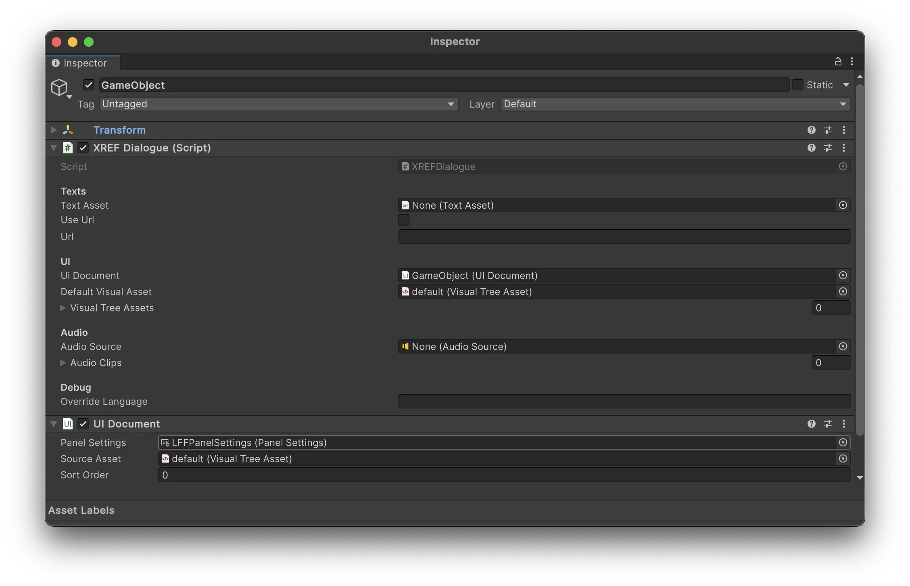
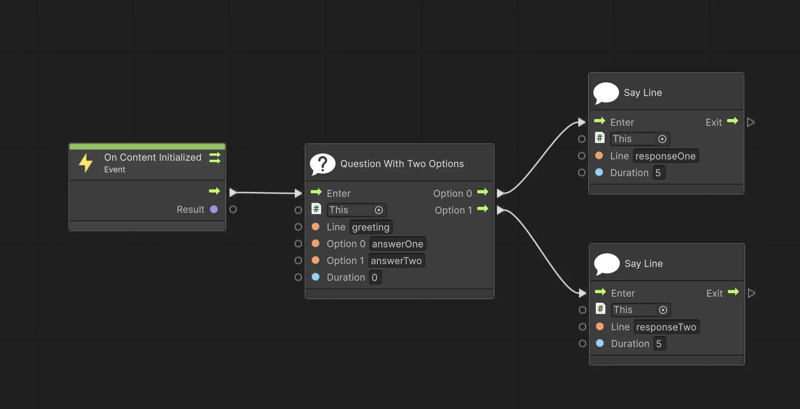
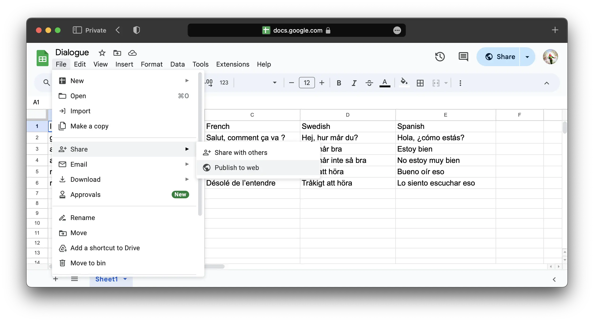
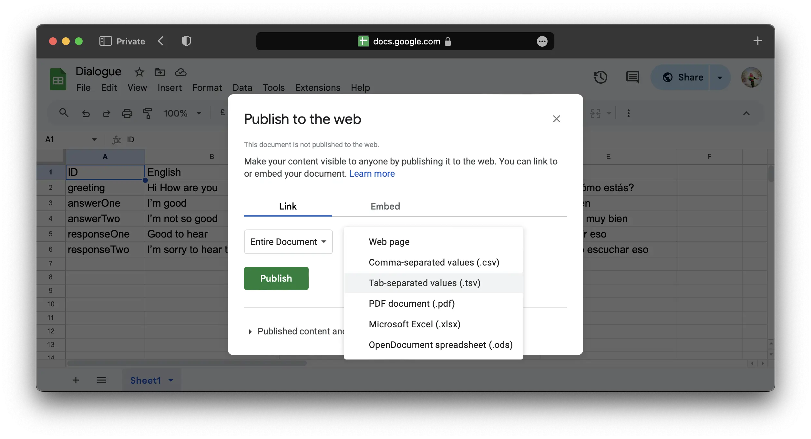
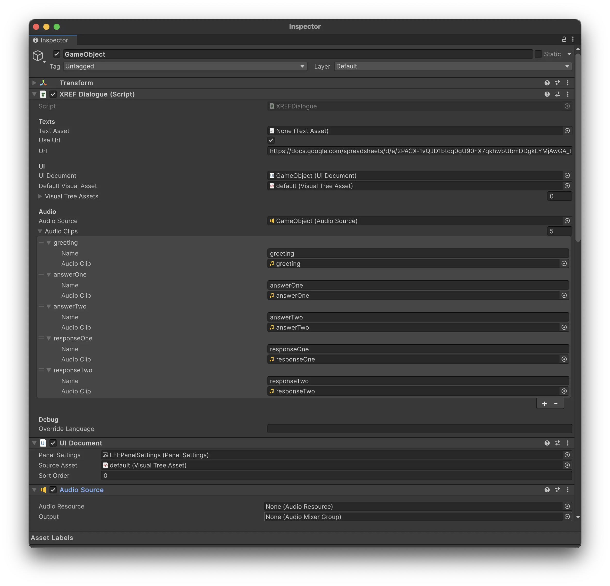

# XREF Dialogue System 

The Dialogue System is a tool for creating interactive conversations in your Meadow experiences. It allows you to create branching dialogues with multiple choices and responses, and  create your own RPGs. 

Your dialogue tree is constructed from a `.tsv` sheet with a list of lines of dialogue, each with a unique ID. You can add as many languages as you want, the system will automatically detect the system language and use the correct one. If the system language can't be found, it will default to english. 

### Dialogue System Properties:

**Texts**
- **Text Asset**: `TextAsset` - A `TextAsset` with a `.tsv` file that contains the dialogue.
- **Use URL**: `bool` - If true, the dialogue will be fetched from a URL.
- **URL**: `string` - The URL to fetch the dialogue from. Needs to be a publicly available csv file. See section "Use the Dialogue System with a URL" for more information.

**UI**
- **UIDocument**: `UIDocument` - The UI that will be used to display the dialogue.
- **Default Visual Asset** `VisualAsset` - The visual asset that will be used to display the dialogue. Leave empty to use the visual asset referenced in the `UIDocument`.
- **Visual Tree Assets** `List<VisualAsset>` - A list of visual assets that can be used to display the dialogue, if you want to use different ones for different sections. You can switch between these in the visual scripting.

**Audio**
- **Audio Source**: `AudioSource` - The audio source that will be used to play the dialogue audio.
- **Audio Clips**: `List<AudioClip>` - A list of audio clips that will be used to play the dialogue audio, each corresponding to one line of dialogue.

**Debug**
- **Override Language**: `string` - Specify which language you want to use. If left empty, the system will use the system language.

 

## Using the Dialogue System

1. Add the `XREF.DialogueSystem` prefab to any game object in your prefab. 
2. Create a `UIDocument` and add it to the `UIDocument` field in the `XREF.DialogueSystem` component. This is the UI that will be used to display the dialogue. It can be added to any game object.
3. Add a `VisualAsset` to the `UIDocument`. You can create one yourself, or use a default one located in `packages/XREF.Experiencebuilder/Runtime/Dialogues/VisualTreeAssets/default`. To create your own visual asset, see section "Create your own visual asset".
4. Add a `Panel Settings` to the `UIDocument`. You can create one yourself, or use a default one that you find when clicking the little circle next to the `Panel Settings` field.
5. Add your dialogue tsv to the `TextAsset` field in the `XREF.DialogueSystem` component. You can also use a URL to fetch the dialogue from. See section "Use the Dialogue System with a URL" for more information.
6. Create your dialogue tree in visual scripting. See section "Create your dialogue tree" for more information.

 

## Create your dialogue tree 

The XREF Dialogue System comes with a range of nodes for you to build dialogue trees. All nodes are found in `XREF > Dialogues` among the visual scripting nodes. 

Here is an example of a basic dialogue tree:

In this example, the dialogue starts with a `Question with Two Options`node, the line that is said is `greeting`. The two options are `answerOne` and `answerTwo`. This is displayed to the user with one line with the text in `greeting` and then two buttons, each with the text in `answerOne` and `answerTwo`. Depending on which of these buttons the user press, the response is either `responseOne` or `responseTwo`.

In each node you can either specify an ID that takes the line from a `.tsv` file, or you can specify the line directly in the node.

 
### List of nodes:

**Say Line** - Prints a line to the user. 

- **Game Object**: `GameObject` - The game object with the XREFDialogue component. Use `this` to reference the game object the visual scripting is on.
- **Line**: `string` - The line you want to say, or the ID of the line in the `.tsv` file.
- **Duration**: `float` - The duration the line will be displayed in seconds. If 0, the line will be displayed continuously.

**Question with N Options** - Asks a question to the user with N options. There is currently the choice of 1, 2 or 3 options. 

- **Game Object**: `GameObject` - The game object with the XREFDialogue component. Use `this` to reference the game object the visual scripting is on.
- **Line**: `string` - The line you want to say, or the ID of the line in the `.tsv` file.
- **Options X**: `string` - The text of the option, can be referenced directly or through an ID in the `.tsv` file. X is the number of the option.
- **Duration**: `float` - The duration before the user can press either of the buttons. 
- **Port: Option X**: `Flow` - The port that will be triggered when the user presses the button for option X. 

**Say Line Custom Property** - Prints a line to the user on a specific `Label` element in your visual asset.

- **Game Object**: `GameObject` - The game object with the XREFDialogue component. Use `this` to reference the game object the visual scripting is on.
- **Line**: `string` - The line you want to say, or the ID of the line in the `.tsv` file.
- **Property**: `string` - The Visual Asset property you want to display the text on. 
- **Duration**: `float` - The duration the line will be displayed in seconds. If 0, the line will be displayed continuously.

**Set Visual Asset** - Sets the visual asset used by your UIDocument.

- **Game Object**: `GameObject` - The game object with the XREFDialogue component. Use `this` to reference the game object the visual scripting is on.
- **Visual Asset**: `VisualAsset` - The visual asset you want to use.
- **Set Enabled**: `bool` - If true, the visual asset will be enabled. If false, it will be disabled.

 
## Create a Dialogue `tsv`

In any text editor, create a `.tsv` file where the first row contains the languages you want to use. The first column should contain the ID of the line, and the following columns should contain the dialogue in the corresponding language.

**Example:**

| ID | English         | French                   | Swedish          | Spanish          |
| greeting | Hi How are you  | Salut, comment ça va ?   | Hej, hur mår du? | Hola, ¿cómo estás? |
| answerOne | I'm good        | Je vais bien             | Jag mår bra      | Estoy bien       |
| answerTwo | I'm not so good | Je ne vais pas très bien | Jag mår inte så bra | No estoy muy bien |
| responseOne | Good to hear    | Content de l'entendre    | Gott att höra    | Bueno oír eso    |
| responseTwo | I'm sorry to hear that | Désolé de l'entendre | Tråkigt att höra | Lo siento escuchar eso |

You can use which languages you want. The system will automatically detect the system language and use the correct one. If the system language can't be found, it will default to english.

It is good practice to use human readable ID's for the lines. It will make it easier to keep track of the dialogue and you don't need to cross reference everytime you forgot what line `b1c9` was. 

<b>Please note:</b> Unity does not recognize `.tsv` files as text assets by default. You need to change the file extension to e.g. `.csv` and then import it, to trick Unity into thinking it's a text file. This doesn't change the content of the file.

 

## Use the Dialogue System with a TextAsset

1. Save your `.tsv` file to disk.
2. Due to a limitation in Unity, you need to change the file extension to `.csv` before importing it. This does not change the content of the file.
3. Import the `.csv` file to your project. Unity will display it as a `TextAsset`. Place it in the folder of your experience to make sure it's included in the asset bundle.
4. Reference the `TextAsset` in the `XREF.DialogueSystem` component in the `Text Asset` field.

 

## Use the Dialogue System with a URL

1. Publish your `tsv` file to a publicly available URL.
2. Reference the URL in the `XREF.DialogueSystem` component in the `URL` field. Toggle the `Use URL` bool to true.

This is the process for publishing your tsv if you are using Google Sheets:
1. Go to `File > Share > Publish to the web`.
2. Choose `Entire Document` and `Tab-separated values (.tsv)` as the format.
3. Press `Publish`.
4. Copy the link and use it in the `URL` field in the `XREF.DialogueSystem` component.
5. Any changes you do to the Google Sheet is automatically reflected in your experience.

 

## Create your own visual asset

You can create and use your own visual asset to display the dialogue. 

If you want to be able to use the `Say Line` you need to add a `Label` element to your visual asset with the name `text`. You can use another name, but then you need to specify the name in the `Say Line Custom Property` node.

If you want to be able to use the `Question with N Options` you need to add a `Button` element to your visual asset with the name `optionX` for each option, e.g. `Option0`, `Option1`, `Option2`. 

You can also make a copy of the `default` visual asset and modify it to your liking.

 

## Using Audio Clips

The dialogue system can play audio clips for each line of dialogue. You add audio clips to the `Audio Clips` list in the `XREFDialogue` component. 

1. Add an `AudioSource` somewhere in your prefab. Reference it in the `XREFDialogue` component in the `Audio Source` field. The `AudioSource` is the virtual speaker in space that will play the audio clips. If your dialogue will be spoken by a virtual character, place the audio on the character's head or mouth to make use of Unity's spatial audio.
2. You don't need to do anything with the `AudioSource` component, but if you want to utilize spatial audio you need to change `Spatial Blend` to 3D and set the `Max Distance` to a value that makes sense in your experience, often around 5 meters to make it noticable.
2. Add your audio clips to the `Audio Clips` list in the `XREFDialogue` component. 
3. For each list item, add a `string` and an `AudioClip`. The `string` is the ID of the line in the `.tsv` file that you want to play the audio for. This system is in place so that you may easily change audio clips during testing, without having to rename them. You do not need to have one audio clip for every line in your dialogue, only the ones with a corresponding audio clip will be played. 

<b>Please note:</b> Meadow currently does not support separate audio clips for different languages. Let us know if you need this feature, and we'll add it.

Example using the dialogue tree from the previous section:

