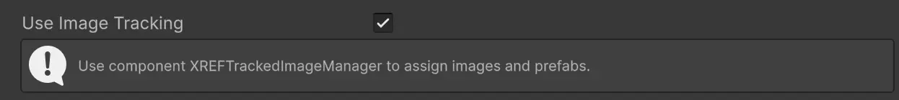
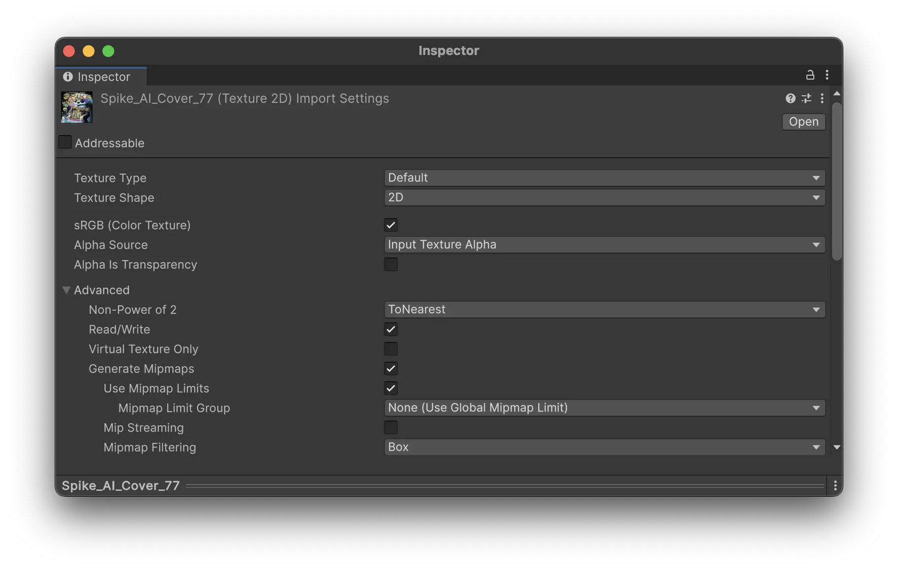
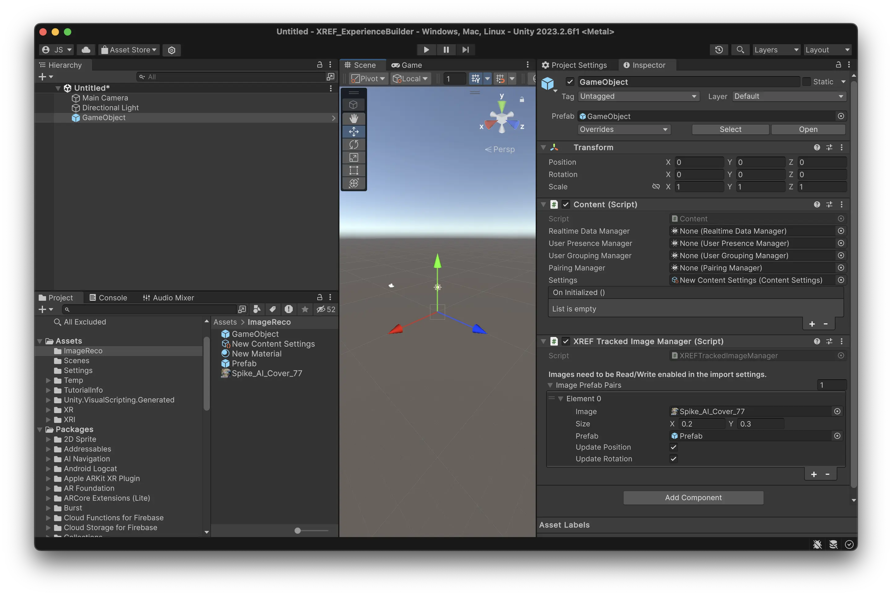
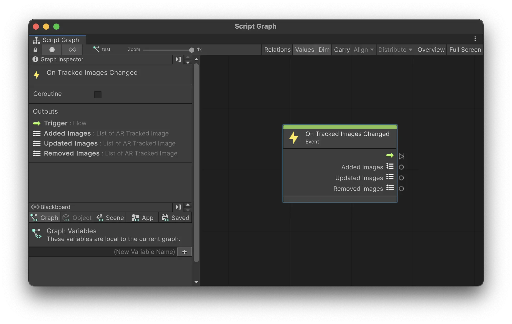

# Image Tracking {#image-tracking}

Meadow allows you to create experiences that are triggered by images. This is a way to create interactive XR experiences that are triggered by posters, paintings, or any other image. 

## Enable Image Tracking

In your content settings, toggle `Use Image Tracking` to enable image tracking for your experience.

## Import and Prepare Images

The images you want to track need to be imported into your experience and included in your asset bundle. 

1. Import the images you want to track into your project.
2. Make sure to enable the `Read/Write` option in the import settings for the images.

## Using XREF Tracked Image Manager

The `XREF.TrackedImageManager` allows you to easily place prefabs on top of images.

1. Add the `XREF.TrackedImageManager` prefab to your main prefab. It can be on any GameObject. 
2. For each image you want to track, add a new entry to the `Image Prefab Pairs` list.
3. Drag the image you want to track to the `Image` field.
4. Drag the prefab you want to place on top of the image to the `Prefab` field.
5. Specify the `Size` of the image in meters. This is the size of the image in the real world.
6. Toggle `Update Position` and `Update Rotation` to update the position and rotation of the prefab when the image is moving.

## Using Visual Scripting Event OnTrackedImagesChanged

You can also use visual scripting to trigger logic when an image is tracked for more granular control. 

**Parameters:**
- **Added Images**: `List<ARTrackedImage>` - New images added to the tracked images list since the last event.
- **Updated Images**: `List<ARTrackedImage>` - Images that have been updated.
- **Removed Images**: `List<ARTrackedImage>` - Images that have been removed from the tracked images list.

## Common Issues

### Instantiated Prefab Transform

Make sure the position of the prefab is set to `0, 0, 0,` to place it in the middle of the image that is being tracked. 

Also, make sure the scale is set to something that the user can see. If the prefab is very large the user will not see it as it is instantiated since they are standing inside of it. For example, if the user is standing 1 meter away from the image that is tracked, and the prefab is larger than 1 meter in size, the user might not see it. 

### Image is not recognized

Make sure that the image is set to `Read/Write` enabled in the import settings.