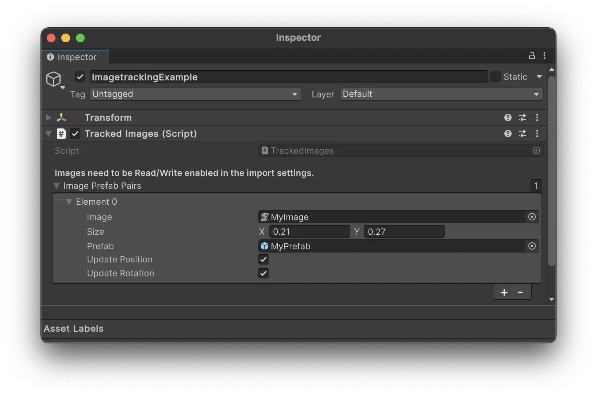

# Image Tracking {#image-tracking}

Meadow allows you to create experiences that are triggered by images. This is a way to create interactive XR experiences that are triggered by posters, paintings, or any other image. 

## Enable Image Tracking

In your content settings, toggle `Use Image Tracking` to enable image tracking for your experience.

## Import and Prepare Images

The images you want to track need to be imported into your experience and included in your asset bundle. 

1. Import the images you want to track into your project.
2. Make sure to enable the `Read/Write` option in the import settings for the images.

## Use XREF Tracked Image Manager

The `XREF.TrackedImageManager` allows you to easily place prefabs on top of images.

1. Add the `XREF.TrackedImageManager` prefab to your main prefab. It can be on any GameObject. 
2. For each image you want to track, add a new entry to the `Image Prefab Pairs` list.
3. Drag the image you want to track to the `Image` field.
4. Drag the prefab you want to place on top of the image to the `Prefab` field.
5. Specify the `Size` of the image in meters. This is the size of the image in the real world.
6. Toggle `Update Position` and `Update Rotation` to update the position and rotation of the prefab when the image is moving.

