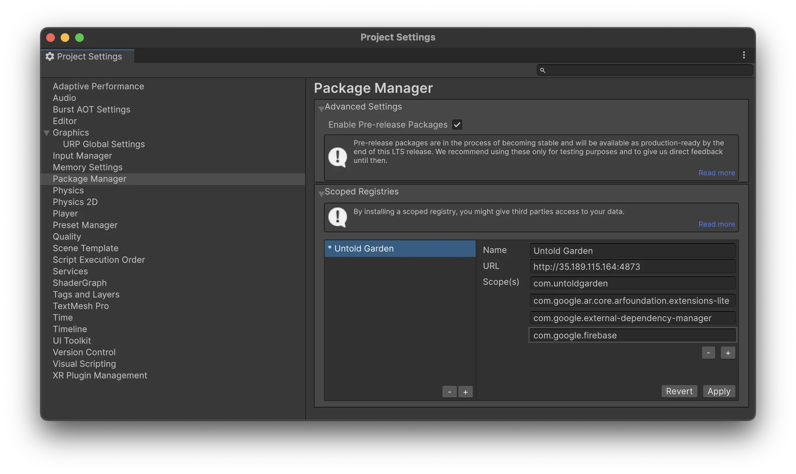
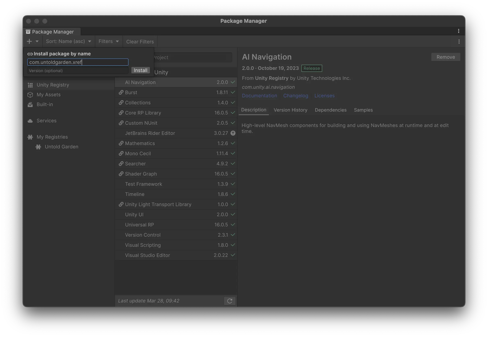

# Importing XREF Packages into an Existing Unity Project

**This step is not needed if you are using the template project.**

You can integrate our packages into an existing Unity project. Our packages are available through a scoped registry, and you can add them directly to your project. 

The packages you'll need are:

- **XREF**: The Extended Reality Experience Framework, providing the core functionality for creating immersive experiences.
- **XREF.ExperienceBuilder**: Adds advanced features for creating experiences, including audio interaction, dialogue, and character movement tools.
- **XREF.AssetBundleBrowser**: Aids in managing and deploying asset bundles for your project.

 
## Adding Packages to Your Project

### Add the Scoped Registry

1. In Unity, go to `Edit` > `Project Settings` > `Package Manager`.
2. Enable the option for `Enable Pre-release Packages`.
3. Add the Untold Garden scoped registry to your project:
   - Name: `Untold Garden`
   - URL: `http://35.189.115.164:4873`
   - Scopes: 
        - `com.untoldgarden` 
        - `com.google.ar.core.arfoundation.extensions-lite`
        - `com.google.external-dependency-manager`
        - `com.google.firebase`

4. Add the Game Package Registry by Google scoped registry to your project: (This requirement will be removed in a future release.)
   - Name: `Game Package Registry by Google`
   - URL: `https://unityregistry-pa.googleapis.com`
   - Scopes: `com.google`

### Add the Packages

1. In Unity, go to `Window` > `Package Manager` to open the package manager.
2. Click the `+` button in the top-left corner of the Package Manager.

3. Select `Install package by name`.
4. Search for and add the following packages to your project:
   - com.untoldgarden.xref
   - com.untoldgarden.xref-experience-builder
   - com.untoldgarden.xref-assetbundlebrowser
5. You should now see the packages in your list

