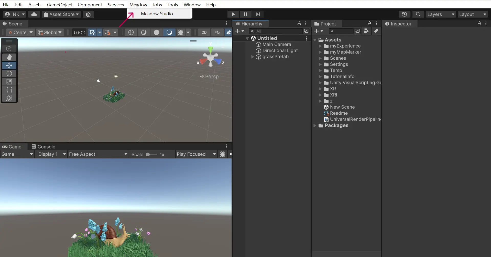
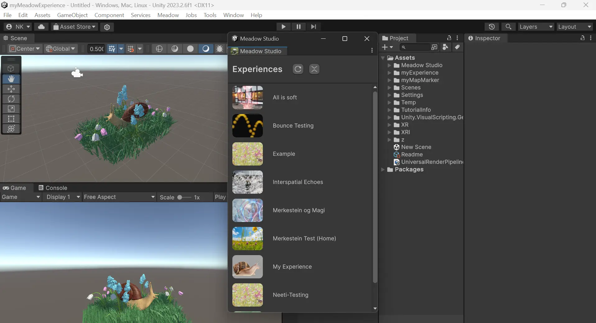
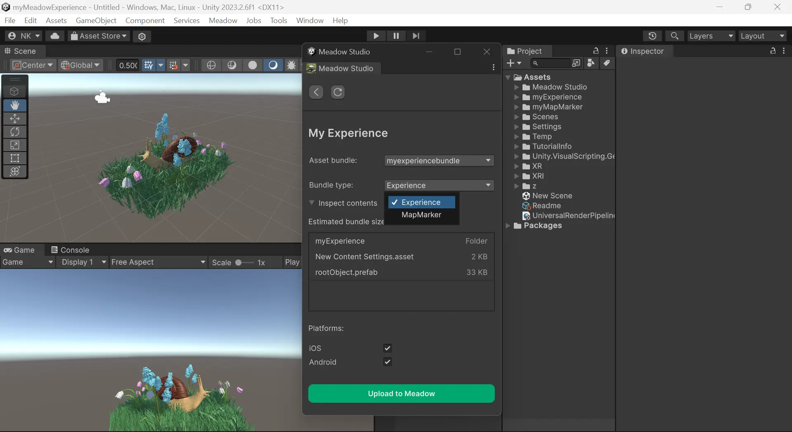

# Meadow Studio {#meadow-studio}

Meadow Studio is a plugin for Unity that makes the entire process of building for Meadow 10x faster, and more streamlined. It enables you to:

🌱  Build and upload experiences straight to Meadow

🌻  Automatically set your project settings for Meadow compatiblity

🌷  Add optional packages for creating complex experiences

To create a new project however, you must used the webapp:
[Meadow Space](https://app.meadow.space/)

 
## Download Meadow Studio 

Go to:
[Download Meadow Studio](https://app.meadow.space/dashboard/meadow-studio)
(https://app.meadow.space/dashboard/meadow-studio)

Click Download. Once downloaded, drag and drop the package into your project window.

 
## Login

Find the Meadow tab in Unity and open the Meadow Studio window. 

Here you can log in to Meadow Studio with the details you used when first making your Meadow account. This will ensure all your projects are synced and up to date.

 
## Upload 

Once you are logged in successfully, you will see all your experiences listed. Click refresh if something is not up to date. 

Open the experience you would like to update. Here you can choose which bundle to assign to it and whether you are trying to update the experience bundle or the map marker bundle. Once picked, enable for the platform / platforms of your choice, and click Upload to Meadow. 

If you have more updates to publish later on, simply repeat this process to update again.

**ATTENTION:** Make sure to choose the correct bundle and bundle type.

 

Snail by Rafael Rodrigues
Grass by MauroGonzalezA
Flowers by Vish4More

[CC Liscence](https://creativecommons.org/licenses/by/4.0/)

