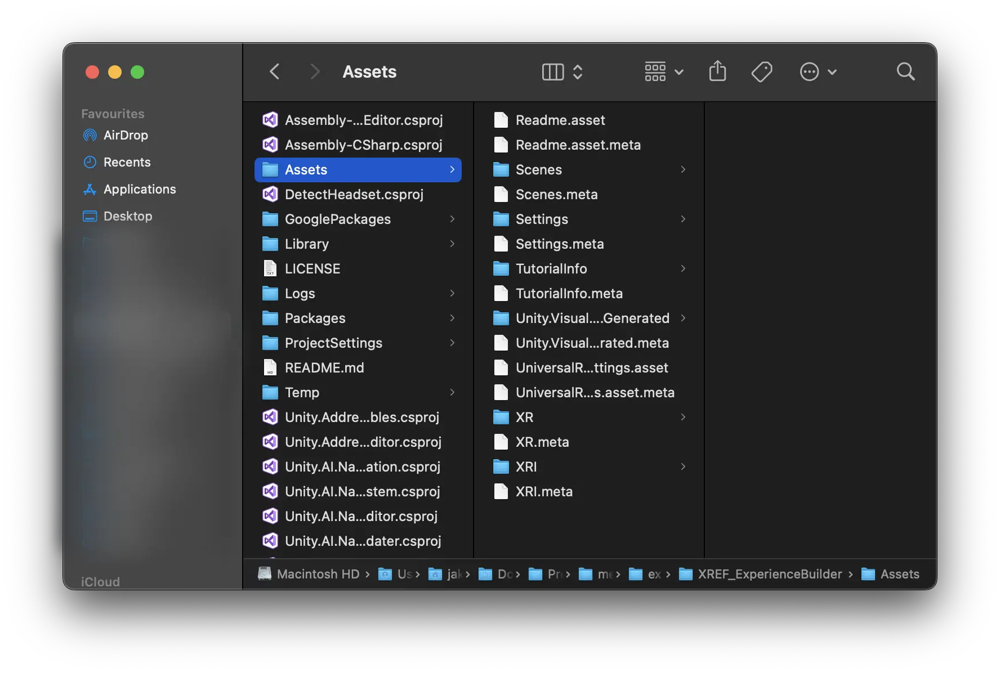
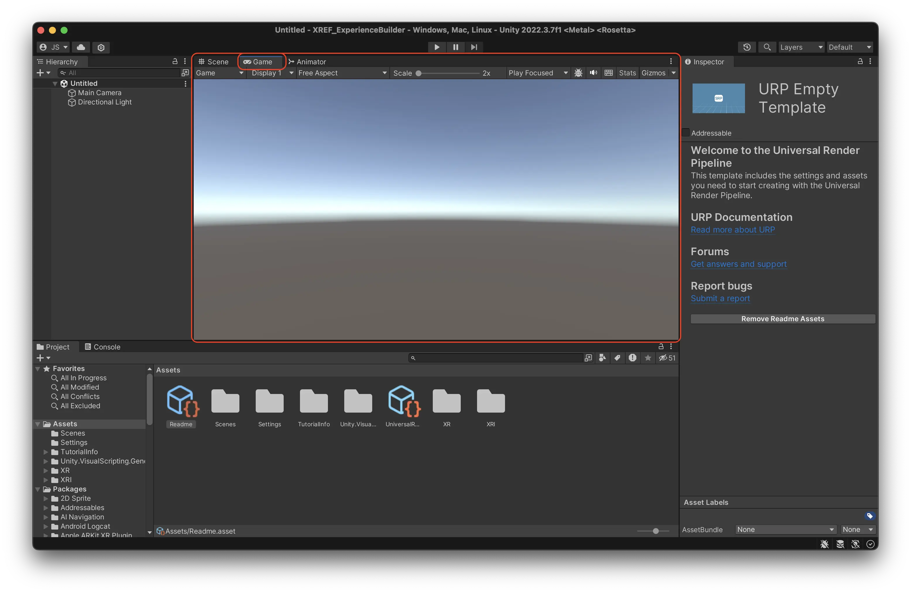
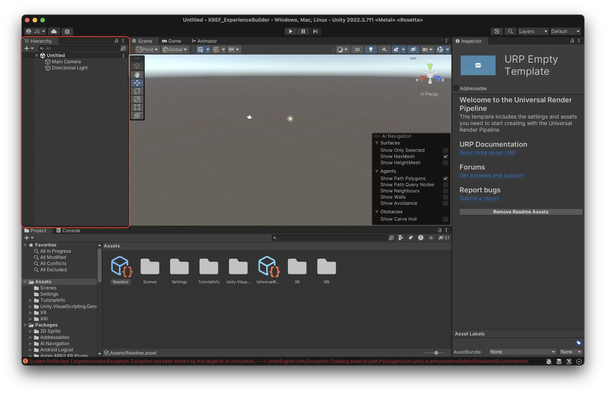
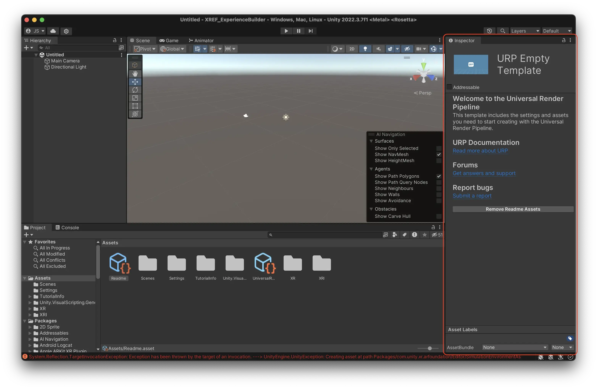
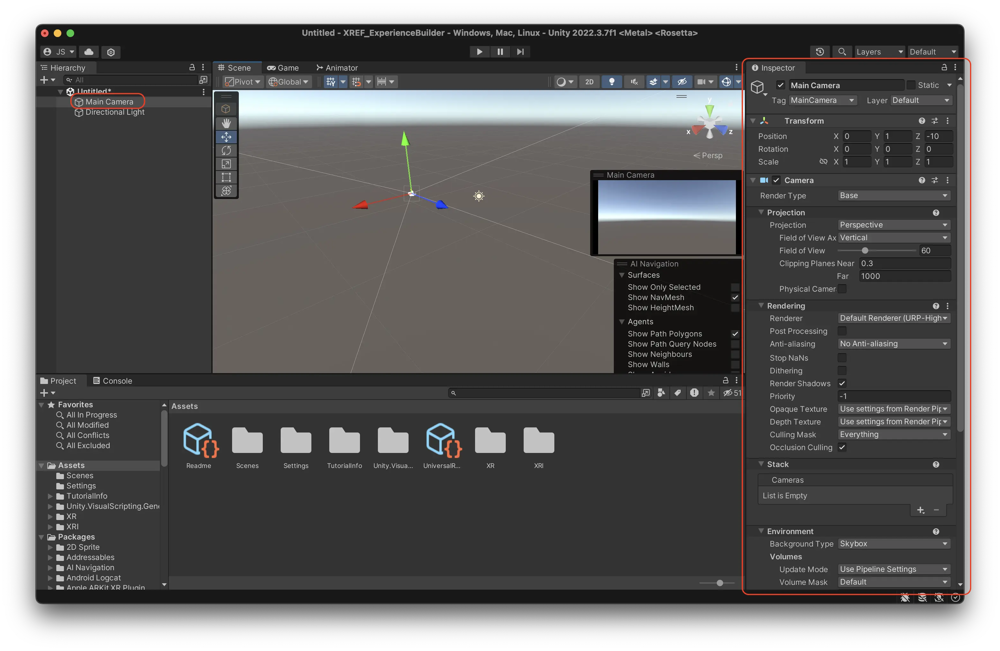
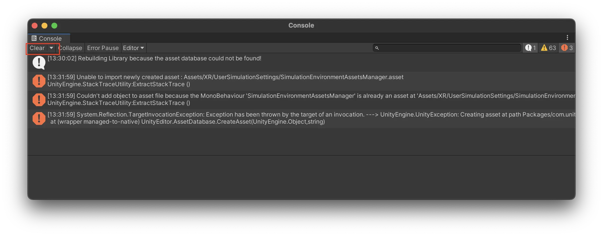
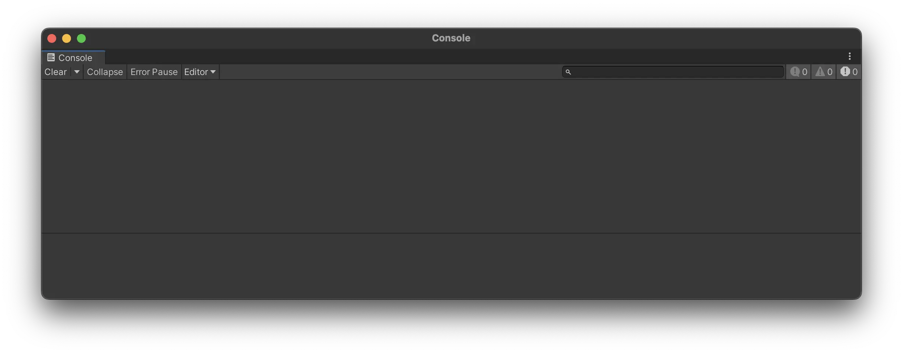

# Navigate the Unity editor  {#navigate-the-unity-editor}

Unity is like a theatre stage, or film set, where all the components of your experience come together. It will not do anything unless you put great assets and actors following a good script on it.

* Visual scripting is your script writing and project planning. What should happen where and when, and how? For meadow we use visual scripting, you do not need to write any code.
* The asset creation is your prop / set / costume construction. This doesn't happen on the stage (Unity), but happens in a separate workshop (Blender, photoshop, etc.)
* Meadow is your audio/video tech, this is what's needed for you to distribute what you see to an audience. 

## Starting Unity {#starting-unity}

When you first open the template project the window will look something like this. 

The Unity editor is divided into many different windows. The six most important are:

## Project Window {#project-window}

The Project Window acts as your central hub for all the assets in your Unity project. It mirrors the contents of your project's folder on your computer's file system. Any modifications made within this window are automatically saved and reflected in the corresponding Finder (or File Explorer on Windows) directory, and vice versa. 

Is the same as:

## Scene View {#scene-view}

The Scene View is your interactive canvas where you create your experience. Here, you can place, arrange, and manipulate objects. This view offers a variety of tools and perspectives, allowing you to navigate and edit your scene from different angles and scales. 

### Navigation in Scene View

Zooming:

* **Mac:** Use two fingers to scroll up or down on the trackpad.
* **Windows:** Use the scroll wheel on your mouse.

Rotating:

* **Mac:** Hold down the ‘Option’ key, click and drag with your mouse or trackpad.
* **Windows:** Hold down the ‘Alt’ key, click and drag with your mouse.

Dolly (Pan):

* **Mac:** Hold down both the ‘Option’ and ‘Command’ keys, then click and drag with your mouse or trackpad.
* **Windows:** Hold down both the ‘Alt’ and ‘Middle Mouse Button’, then drag with your mouse.

## Game View {#game-view}

The Game View provides a preview of your experience. It renders the game from the perspective of the active camera. In AR, the users phone camera is the active camera, so this is not an accurate rendition of what the user will see. Move the camera around to simply mimic user behaviour in your scene. 

## Hierarchy Window {#hierarchy-window}

The Hierarchy Window displays all the game objects present in your experience, organized in a tree structure. Each item in the hierarchy represents a game object, and child objects can be nested under parents, establishing a clear and manageable structure.  \
 \
By default, Unity will have placed a Camera and a Directional Light here. \
 \
In the hierarchy, you are working in what is called a Scene. A scene in Unity works pretty much like a scene in any other context. If you create a game for example, every level might be a scene. In this example, and in most other cases, you only need to work in one scene. 

**IMPORTANT: **The scene is the only thing that isn’t saved automatically in Unity. You need to manually save the scene by pressing cmd + s (ctrl + s on Windows.) If you do not do this, the way you have configured your hierarchy will be lost.

## Inspector Window {#inspector-window}

The Inspector Window provides detailed information and customizable properties for the currently selected game object or asset. Here, you can view and modify attributes such as position, rotation, scale, and any attached components or scripts. 

 \
If you select the ‘Camera’ object from your hierarchy, you will see that it has a Transform component that gives it a position, scale and rotation, as well as a Camera component, that renders a view of the scene to the Game View.

## Console Window {#console-window}

The Console Window serves as Unity's output log, displaying messages, warnings, and errors generated by your game and scripts. It is a valuable resource for debugging and troubleshooting, helping you identify and resolve issues during development.

There might be errors in your console when you first open the template project. Unity sometimes throws errors when you open it, those are nothing to worry about. 

1. Press the little button called ‘Clear’ in the top right corner of the window. 
2. If all errors are gone, all is good and you are ready to start building.

3. If some errors persist, then something has gone wrong when setting up the project. Check the steps of ‘Install the Template Project’ again or reach out to support.
4. There might be many warnings. In normal programming, warnings are important to keep an eye on. But for our purposes, they are not important.
5. Press the yellow warning triangle to hide all future warnings.
