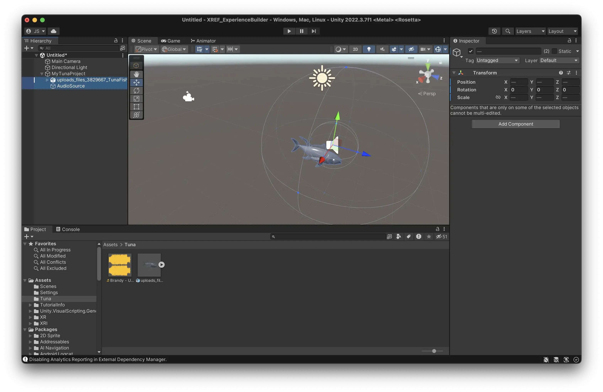
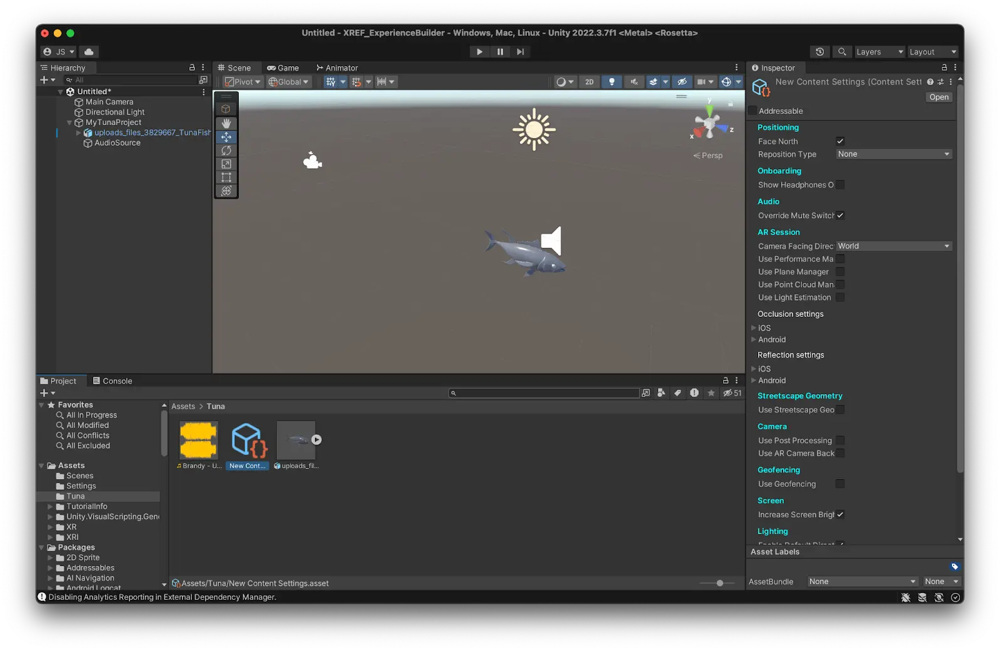

# Upload to Meadow {#upload-to-meadow}

To see your experience on your device, and to share it with others, you can upload it to Meadow. This saves you building a bespoke app.
To upload you need the plugin [Meadow Studio](https://manual.meadow.space/meadow-studio.html) installed in your project. This connects your Unity project directly to your Meadow experience, allowing for quick testing. 

## Create an account on Meadow 

Meadow is still in a closed beta, so your email need to be whitelisted by us before you can create an account. Contact support to get your email whitelisted.

1. Go to the Meadow portal at: [https://app.meadow.space/](https://app.meadow.space/)

2. Press 'Login' at the top right corner. 

3. Sign up with an email you have access to. The verification email sometimes end up in the trash. Certain non-standard email providers and government accounts blocks our verification email, use a standard gmail or outlook address instead. 

**KNOWN ERROR:** Currently it's not possible to use spaces in your name. We are working on fixing this, until that's done, use a name without spaces.

## Create an experience on Meadow

1. In the dashboard, press 'Go to Experiences' 

2. Now you are in the Experience tab where any Experience you make or collaborate on will be visible. On the top right, click '+ New Experience'

3. Fill in the Title and any other details. Keep in mind, you can always edit these later.
4. You can skip past the Deploy section for now as [Meadow Studio](https://manual.meadow.space/meadow-studio.html) is a more streamlined way of getting this done.

5. In the 'Distribution' section, double click anywhere on the map to place your experience in that location. You can search for a particular location, or place it where you are. Bear in mind, depending on your settings, you may not be able to open the experience if it is too far away from you.
6. You can toggle 'Available Everywhere' on or off depending on your preference. If 'Available Everywhere' is on, the Placement Type is automatically 'In Front of Camera', which works anywhere, including indoors. If 'Available Everywhere' is turned off, other than 'In Front of Camera', you also have the 'Geospatial' option. This uses Google streetview to place the experience, and as such, does not work indoors as there is no streetview there. 
7. Save this as a draft for now.  

## Add your experience as children to an empty GameObject

1. In Unity, create a new empty object in your Hierarchy and give it a sensible name. This is the root object of your experience, that will contain all the other objects.
<b>Please note:</b> Make sure that the root object is at position X = 0, Y = 0, Z = 0. Otherwise your experience will be placed in the wrong location in Meadow.

2. Select all the objects that you have created for your experience.

3. Drag them on top of the new empty object. This turns them into children to that object.

In programming, ‘child’ means an object that is below another object in a hierarchy. Conversely, ‘parent’ is an object that is above another in the hierarchy. And, ‘sibling’ is an object that is on the same level in the hierarchy. A ‘root’ object is the object that is at the top of a hierarchy, that has no further parents. 

In the example above you see that both the tuna 3D model and the Audio Source are children to MyTunaProject. 

## Add a Content component to your root object

1. Select the empty object
2. Press ‘Add Component’, search for Content, and add it.

This is a script that tells the Meadow platform that this is a piece of content that should be displayed in the app. 

It contains a bunch of fields, but you only need to use the Settings field.

**Content will be renamed to Experience in the near future.**

## Create your content settings. 

The Content settings tells the Meadow app how your experience should be presented in the app, and contains a bunch of useful features that you can use. 

1. In the folder for your experience in the Project Window, right click and select Create -> XREF -> Content Settings.

2. Select the newly created content settings. 
3. There are a bunch of settings in here that you can use. For this example the default settings work well. 

3. Now reference your newly created content settings in the content component of your experience. 
    1. Select your experience root object. 
    2. Drag the content settings into the Settings slot of the Content component. 

4. You should now see the content settings in the settings field of the Content component.

## Add your experience to the project folder

Now you need to add the experience you have created to your folder in the Project Window. When you do this, you create what is called a [prefab](https://docs.unity3d.com/Manual/Prefabs.html). A prefab is a type of object that can be reused in different scenes, and also built as an asset bundle. Unity shows you that it is a prefab by changing the icon in the Hierarchy to a blue cube.

1. Select the root object of your experience (the one with the Content component.)
2. Drag it into the empty area of your folder in the Project Window. 

3. You should now see a blue cube in your folder. This is a prefab of your experience and is what will be played in Meadow.

**ATTENTION:** When you change something in your prefab in the scene, it is not automatically applied to the prefab in your project folder. You need to manually apply any changes by selecting the prefab in the scene, finding the little toggle called ‘Overrides’ in the inspector, and then press ‘Apply all’. This is so that you can have different settings for your prefab in different scenes, but it's not really useful for our purposes.

If you have changed things in your experience but the changes are not showing in Meadow, then forgetting to apply overrides is most likely the reason.

## Use Meadow Studio

Follow the instructions listed [**here**](https://manual.meadow.space/meadow-studio.html) to upload your experience to Meadow via [Meadow Studio](https://manual.meadow.space/meadow-studio.html). 

## Publish

1. You can now return to the webapp. Here, in Experiences, click edit on the draft you had previously made. 
2. On the top right, click Publish.
3. All changes are saved automatically, so any edits made with be reflected in app without having to Publish again.

## Add cocreators to your artwork. 

1. When editing an experience, go to the tab 'Permissions'

2. Add the email address of the people you would like to invite to be able to edit the experience. You can decide to add them as a Viewer or Editor. Editors can upload asset bundles, change texts, images, and place the experience. 