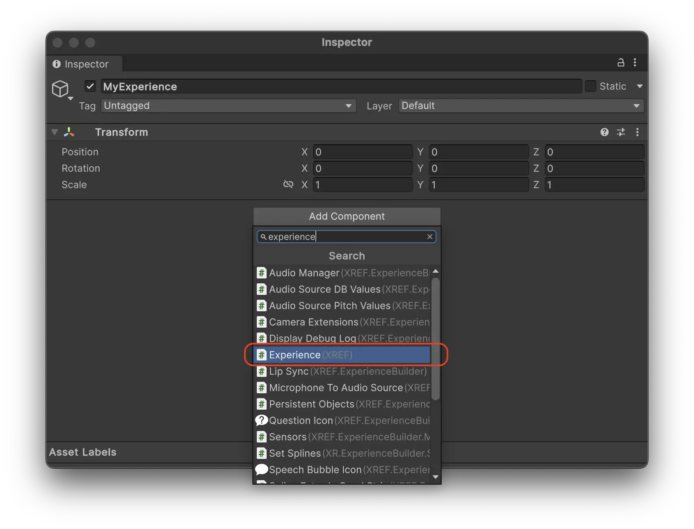
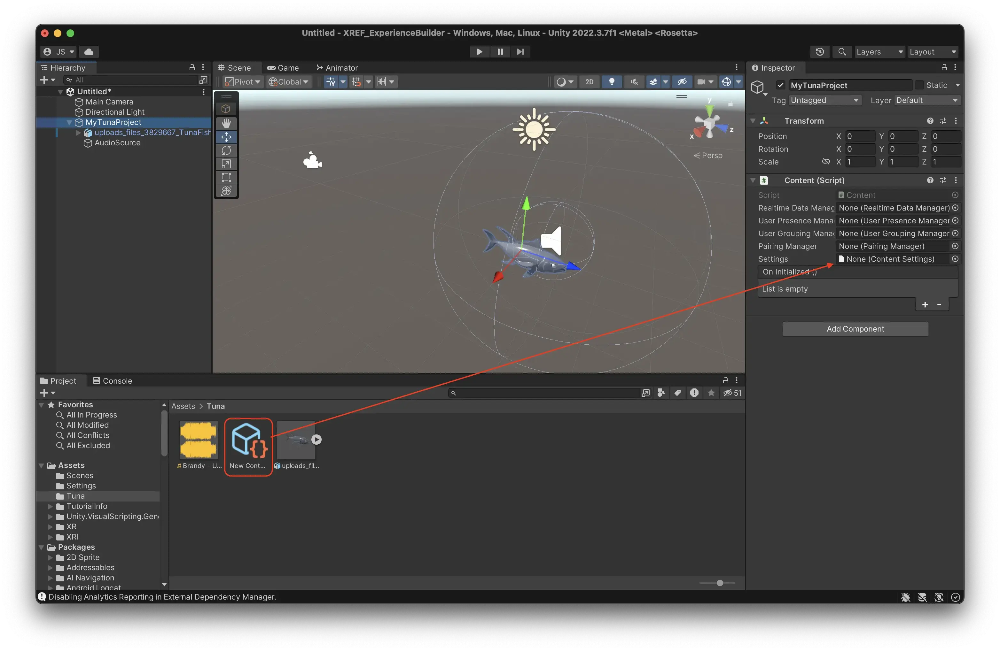
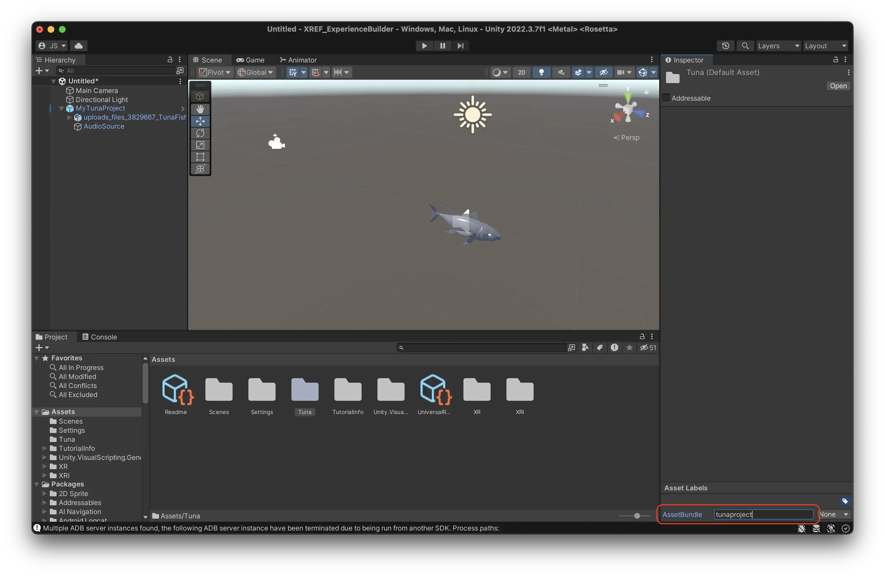
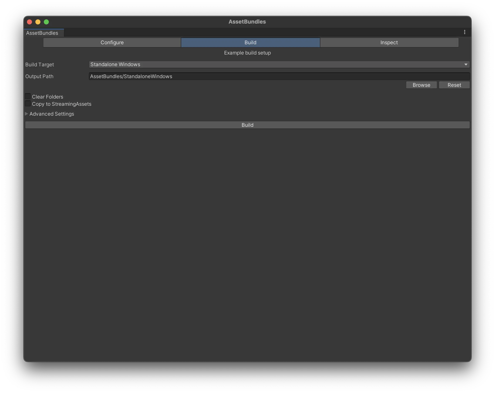
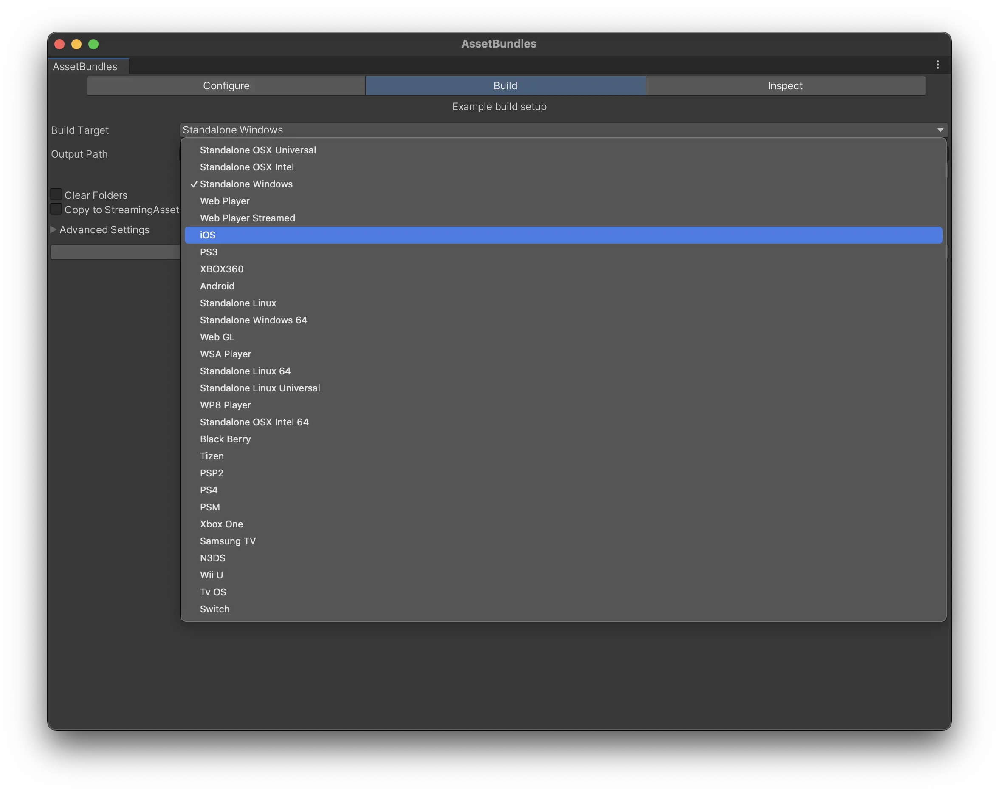
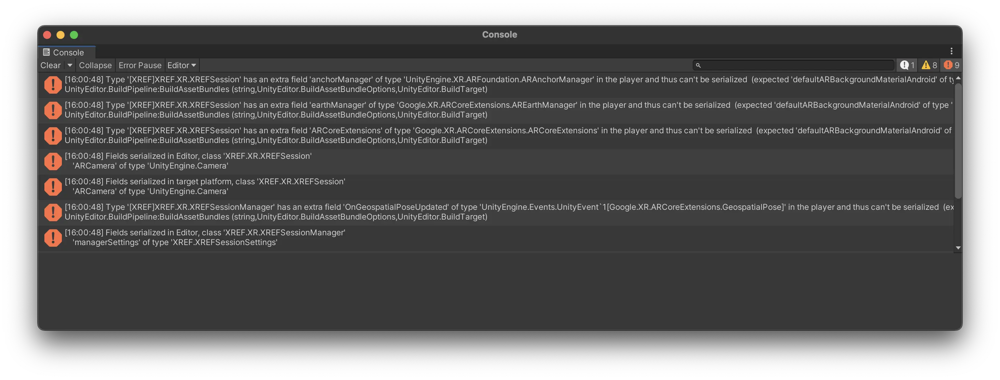
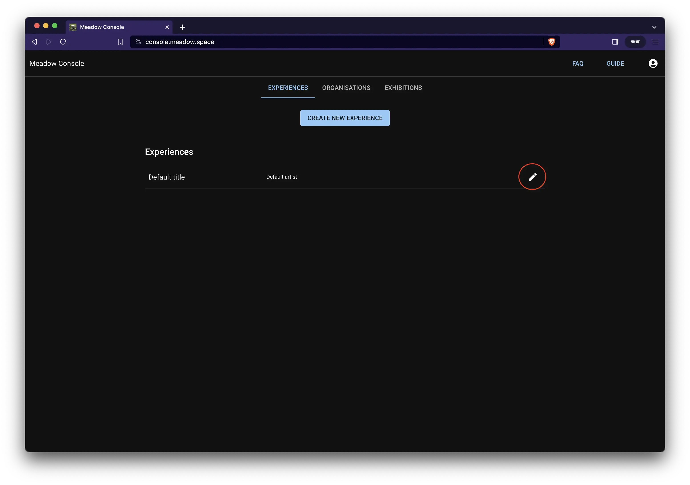
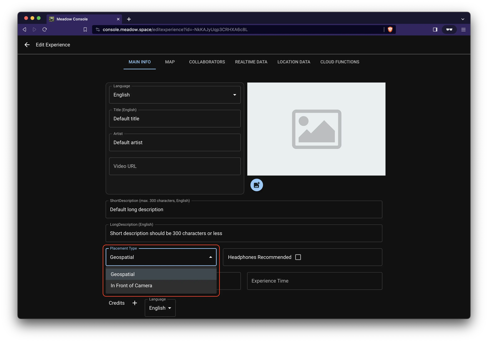
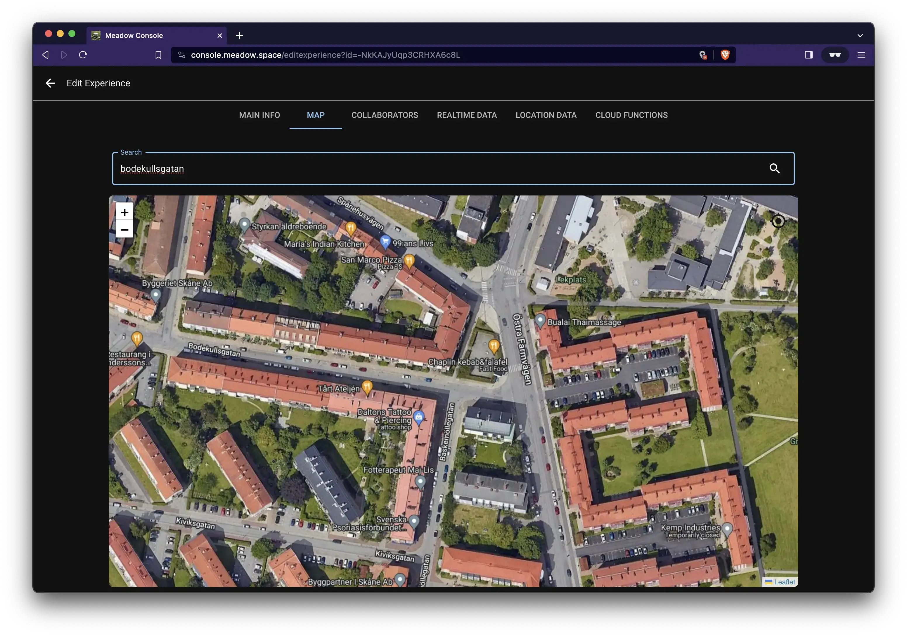

# Upload to Meadow {#upload-to-meadow}

To see your experience on your device, and to share it with others, you can upload it to Meadow. This saves you building a bespoke app.
To upload your experience to Meadow you need to create what is called an Asset Bundle. This is Unity’s file format for bundling assets. It is like Unity’s own zip file. 

## Add your experience as children to an empty GameObject

1. Create a new empty object in your Hierarchy and give it a sensible name. This is the root object of your experience, that will contain all the other objects.

2. Select all the objects that you have created for your experience.

3. Drag them on top of the new empty object. This turns them into children to that object.

In programming, ‘child’ means an object that is below another object in a hierarchy. Conversely, ‘parent’ is an object that is above another in the hierarchy. And, ‘sibling’ is an object that is on the same level in the hierarchy. A ‘root’ object is the object that is at the top of a hierarchy, that has no further parents. 

In the example above you see that both the tuna 3D model and the Audio Source are children to MyTunaProject. 

## Add a Content component to your root object

1. Select the empty object
2. Press ‘Add Component’, search for Content, and add it.

This is a script that tells the Meadow platform that this is a piece of content that should be displayed in the app. 

It contains a bunch of fields, but you only need to use the Settings field.

**Content will be renamed to Experience in the near future.**

## Create your content settings. 

The Content settings tells the Meadow app how your experience should be presented in the app, and contains a bunch of useful features that you can use. 

1. In the folder for your experience in the Project Window, right click and select Create -> XREF -> Content Settings.

2. Select the newly created content settings. 
3. There are a bunch of settings in here that you can use. For this example the default settings work well. 

3. Now reference your newly created content settings in the content component of your experience. 
    1. Select your experience root object. 
    2. Drag the content settings into the Settings slot of the Content component. 

4. You should now see the content settings in the settings field of the Content component.

## Add your experience to the project folder

Now you need to add the experience you have created to your folder in the Project Window. When you do this, you create what is called a [prefab](https://docs.unity3d.com/Manual/Prefabs.html). A prefab is a type of object that can be reused in different scenes, and also built as an asset bundle. Unity shows you that it is a prefab by changing the icon in the Hierarchy to a blue cube.

1. Select the root object of your experience (the one with the Content component.)
2. Drag it into the empty area of your folder in the Project Window. 

3. You should now see a blue cube in your folder. This is a prefab of your experience and is what will be played in Meadow.

**ATTENTION:** When you change something in your prefab in the scene, it is not automatically applied to the prefab in your project folder. You need to manually apply any changes by selecting the prefab in the scene, finding the little toggle called ‘Overrides’ in the inspector, and then press ‘Apply all’. This is so that you can have different settings for your prefab in different scenes, but it's not really useful for our purposes.

If you have changed things in your experience but the changes are not showing in Meadow, then forgetting to apply overrides is most likely the reason.

## Add your files to an asset bundle 

Now we need to tell Unity that everything in this folder should be built into an asset bundle. Unity’s UX for this is rather stupid, but not much we can do about it. 

1. Navigate to your Assets folder in the Project Window.

2. Select your folder, but do not enter it.
3. In the bottom right corner, you see a teeny tiny text saying “Asset Labels”. 

4. Press this text to see the asset bundle menu. Why they placed it in such a strange location, no one knows.

5. Press the foldout menu that currently says “None”.
6. Press new. 

7. Give your asset bundle a sensible name so you can easily recognize it later. This tells Unity that every file in this folder should be built into this asset bundle. This is what you will upload to our platform. 

**ATTENTION: ** Do not use spaces, special characters or capital letters in the name of your asset bundle. This will cause errors when loading it in Meadow. Name it something like “mytuna” or “mytunaexperience”.

## Build your asset bundle

1. In the menu in the top, go to Window -> AssetBundle Browser to open the asset bundle builder. Not XREF AssetBundle Builder, that one is not working at the moment.

2. In the window, select the name of your asset bundle to check that everything is included in it. If not, go through the previous step again.

3. Press the ‘Build’ tab.

4. Select the platform you want to build for. iOS for iPhone, or Android for Android.

5. Press build. The first time you do it it will take a few minutes, after that it will be much faster since Unity caches it.
6. Check the console, if there are no errors it means your build have been successful. 
7. The newly created asset bundle ends up in a folder called AssetBundles in the root folder of your project. 

**KNOWN ERROR:** For iOS users on Mac, the first time you build asset bundles the project will try to install something called ‘CocoaPods’. You will see two new windows appear that are called something like “Installing Cocoapods”. You will get tons of errors in the log and the build will fail. This is a bug that we are working on resolving.

**Resolution:** Restart the Unity editor (no need to restart Unity Hub or the computer). The errors will be gone and the build should work. The ‘Installing Cocapods’ windows might still appear, just close them. You only need to do this step once, the errors will not return.

## Create an account on Meadow 

1. Go to the Meadow portal at: [https://console.meadow.space/](https://console.meadow.space/)

2. Press ‘Don't have an account? Sign Up’ in bottom right corner. 
3. Sign up with an email you have access to. The verification email sometimes end up in the trash. Certain non-standard email providers and government accounts blocks our verification email, use a standard gmail or outlook address instead. 

## Create an experience on Meadow

1. Press ‘Create new artwork’. An experience is still called an ‘artwork’ on Meadow, this will be changed soon.

2. Press the edit button to the right to edit the experience and upload the asset bundle.

3. In this page you can add all the information about your experience, and an image that will be used in the app. 

4. The only thing you need to change now is placement type. This is by default set to “Geospatial”, which uses Google streetview to place the artwork. However, this doesn’t work indoors, since there is no streetview there. To test it at home, change placement type to ‘In Front of Camera’.

5. Scroll down to the asset bundle section
    1. Choose your platform
    2. Press “Upload iOS Bundle” (or “Upload Android Bundle”)
    3. Navigate to where your bundle was saved (usually ProjectFolder/AssetBundles/iOS or ProjectFolder/AssetBundles/Android)
    4. Upload it.

6. If you have built bundles for both platforms, repeat the process for the next platform.
7. Toggle 'Live in app' to make the experience show up in Meadow. You can untoggle this if you want to hide the experience.

## Place the experience 

1. Go to the ‘Map’ tab in the Meadow portal. 

2. Search for the location where you are currently at. 
3. Double click on the map to place the artwork there. 

4. The experience is represented with a red marker on the map.

5. Open the Meadow app to see it. If it doesn’t appear, contact support.

## Add cocreators to your artwork. 

1. Go to the tab ‘Collaborators’
2. Add the email address of the people you would like to invite to be able to edit the experience. These people can upload asset bundles, change texts, images, and place the experience. 